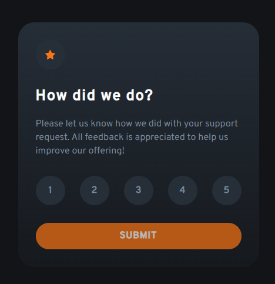

# Frontend Mentor - Interactive rating component solution

<a href="./docs/readme_pt-br.md">In portuguese</a>   

This is a solution to the [Interactive rating component challenge on Frontend Mentor](https://www.frontendmentor.io/challenges/interactive-rating-component-koxpeBUmI). Frontend Mentor challenges help you improve your coding skills by building realistic projects.

## Table of contents

- [Overview](#overview)  
  - [The challenge](#the-challenge)
  - [Screenshot](#screenshot)
- [My process](#my-process)   
  - [Built with](#built-with)
  - [What I learned](#what-i-learned)
- [Author](#author)

## Overview

### The challenge

Users should be able to:

- View the optimal layout for the app depending on their device's screen size
- See hover states for all interactive elements on the page
- Select and submit a number rating
- See the "Thank you" card state after submitting a rating

### Screenshot

## My process

### Built with

- Semantic HTML5 markup
- CSS custom properties
- CSS variables
- Responsive layout
- Interaction with pure JavaScript

### What I learned

I was able to put into practice semantic HTML in the structure of the components and create custom attributes for the tags.  
I reinforced the development of variables and media queries in CSS.  
In JavaSscript, the interaction of numeric buttons and the submit button that is only active after clicking on any numeric button that contains the custom attribute.  

## Author
- Frontend Mentor - [@andrebdasilva](https://www.frontendmentor.io/profile/andrebdasilva)
