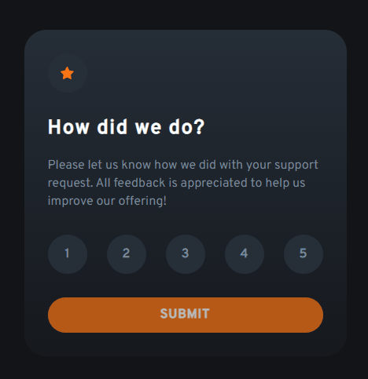

# Frontend Mentor - Componente de avaliação interativa

<a href="/README.md">Em inglês</a>   

Esta é uma solução para o [Desafio do componente de avaliação interativa do site Frontend Mentor](https://www.frontendmentor.io/challenges/interactive-rating-component-koxpeBUmI). Os desafios do site Frontend Mentor estão ajudando a melhorar minhas habilidades de codificação criando projetos reais do dia a dia de um desenvolvedor front-end.

## Índice

- [Visão Geral](#visáo-geral)  
  - [O Desáfio](#o-desáfio)  
  - [Screenshot](#screenshot)   
- [Meu Processo](#meu-processo)  
  - [Construído Com](#construído-com)  
  - [O Que Aprendi](#o-que-aprendi)
- [Autor](#autor)

## Visão Geral

### O Desáfio

Os usuários devem ser capazes de:
- Visualizar o layout de acordo com o tipo de tamanho tela que estiver acessando
- Ver os estados de foco dos botões de avaliação
- Selecionar e enviar uma avaliação numérica
- Ver o estado do cartão de "Obrigado" após enviar uma avaliação

### Screenshot

## Meu Processo

### Construído Com
- HTML5 semântico
- Propriedades CSS personalizadas 
- Variáveis CSS
- Layout responsivo
- Interação com JavaScript puro

### O Que Aprendi

Pude colocar em práticar o HTML semântico na estrutura dos componentes e criar atributos personalizados para as tags.  
Reforcei o desenvolvimento de variáveis e media queries no CSS.  
No JavaSscript a interação dos botões numéricos e no boitão de submit que só fica ativo após clicar em algum botão numérico que contém o atributo personalizado.  

## Autor
- Frontend Mentor - [@andrebdasilva](https://www.frontendmentor.io/profile/andrebdasilva)
